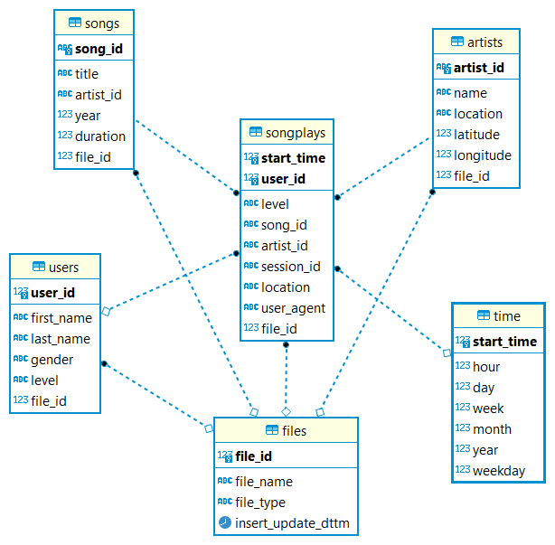
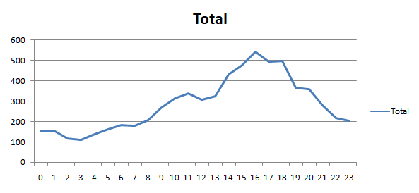

## **Database purpose:**
A startup called Sparkify has an application which provides songs streaming 
capability for the users. The app produce json logs, which contain the 
user activities on the app. The startup wants to understand their users by
analyzing these logs and perform various queries on them easily. 
One of their goals to know what songs are being listened by their users.

## **Database Schema:**
 

 The above image contains the following tables:
 - SONGPLAYS: This table is the main table. It contains song playing 
   transactions generated by the app according to what song has been 
   choosen and played by the user.
   The following are the columns and their description:
   - START_TIME: The timestamp in millisecond for the transaction.
   - USER_ID: The user id for the user who generated this transaction.
     It is a foreign key from the USERS table.
   - LEVEL: The type of the user either free or paid. It holds the 
     level of the user at the timestamp of this transaction.  
   - SONG_ID: The id of the song which has been played by the user.
     It is a foreign key from the SONGS table.
   - ARTIST_ID: The is of the artist for the song played.
     It is a foreign key from ARTISTS table.
   - SESSION_ID: Id for the web session which user was using and resulted
     in generating this transaction.
   - USER_AGENT: text which specify the OS type and version and browser     
     version and type.
   - FILE_ID: Id for the file which is used in loading 
     this row. It is a foreign key from table FILES.  
- ARTISTS: A table which holds list of artists and any information
  related to them.
  The following are the columns and their description:
  - ARTIST_ID: Unique id for the artist in this table.
  - NAME: Name of the artist.
  - LOCATION: The location of the artist geographically.
  - LATITUDE: The latitude of for the artist location. 
  - LONGITUDE: The longitude of the artist location.
  - FILE_ID: Id for the file which is used in loading this row. 
    It is a foreign key from table FILES.
- SONGS: This table holds list of songs and any information related to them.
  The following are the columns and their description:
  - SONG_ID: Unique id for the song in thi table.
  - TITLE: The title of name of the song.
  - ARTIST_ID: The id of the artist of this song.
    It is a foreign key from ARTISTS table.
  - YEAR: The production year of this song. 
  - DURATION: The playing duration of the song.
  - FILE_ID: Id for the file which is used in loading this row. 
    It is a foreign key from table FILES.
- TIME: It is a table for all the timestamps appeared in the transactions 
  loaded in the SONGPLAYS table. It contains addition columns
  derived from the timestamp column itself. These can be used to get 
  insights on different levels (hour,day,week,weekday,month,year).
  
- USERS: This table holds all the users who caused in generating any song 
  playing transaction.
  The following are the columns and their description:
  - USER_ID: Unique Id for the user in the table.
  - FIRST_NAME:The first name for the user.
  - LAST_NAME: The last name for the user.
  - GENDER: the gender of the user(M:male,F:female)
  - LEVEL: The type of the user either free or paid. This column holds the
    latest level for the user appeared into the last log file loaded.
  - FILE_ID: Id for the file which is used in loading this row. 
    It is a foreign key from table FILES.

- FILES: This table hold all the files which had been loaded in this model.
  This table has no relation to the business of the model itself. 
  It is a metadata table.It has been added as type of traceability for 
  the source file of each row in the model to help in investigating 
  in any data quality issue from the source.
  The following are the columns and their description:
  - FILE_ID: Unique id for the row in this table.
  - FILE_NAME: Name of the file. 
  - FILE_TYPE: Type of the file(SNG:Song file,LOG:Log file).
  - INSERT_UPDATE_DTTM: Timestamp for the loading the file. Either it is
    the first time to load or it is loaded again. This timestamp is updated
    everytime the file is loaded. This can help in knowing if the file has
    been loaded or reloaded.

## **Sample Queries:**
- Getting a trend line for the total usage per hour.
  
  - **Query:** 
    
      SELECT t.hour,count(*) Total FROM songplays p
      INNER JOIN TIME t ON p.start_time=t.START_TIME
      GROUP BY t.hour;
  - **Results:**
  From the graph below the peak hour is 4:00 PM
    
    
- Getting the top 10 users who uses the app and their peak hour. This can be used
  to target them by a campaign by sending them promocodes or something like this.
  - **Query:**
  
  SELECT U.USER_ID,U.FIRST_NAME,U.LAST_NAME,X.HOUR Peak_Hour_User
  FROM 
  (
      SELECT X.user_id,Y.hour,ROW_NUMBER()OVER(PARTITION BY Y.USER_ID ORDER BY Y.cnt DESC) R_HOUR
      FROM
      (
          SELECT user_ID,count(*) cnt
          FROM songplays p
          group by user_id
          order by cnt desc
          LIMIT 10
      ) X
      INNER JOIN
      (
          SELECT user_Id,t.hour,count(*) cnt
          FROM songplays p
          INNER JOIN TIME t
          ON p.start_time=t.START_TIME
          group by user_id,t.hour
      )Y
      ON X.user_id = Y.user_Id
  ) X
  INNER JOIN USERS U
  ON U.USER_ID=X.USER_ID
  WHERE R_HOUR=1;

- Getting the count of transactions per gender. Females were the heavy users for the 
  app during that month.
  - **Query:**
    
    SELECT GEnder,count(*) FROM songplays p
    inner join users u
    ON p.user_Id = u.user_Id
    group by gender;
  

