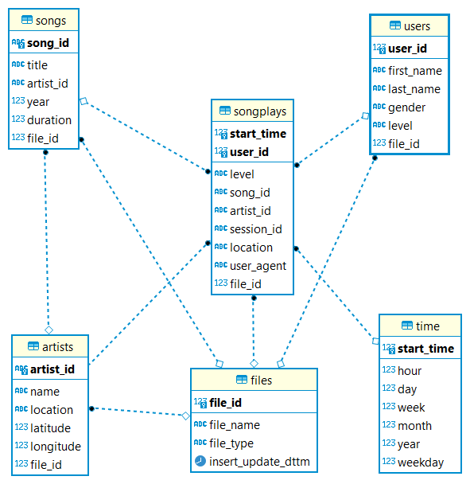

## **Database purpose:**
A startup called Sparkify has an application which provides songs streaming 
capability for the users. The app produce json logs, which contain the 
user activities on the app. The startup wants to understand their users by
analyzing these logs and perform various queries on them easily. 
One of their goals to know what songs are being listened by their users.

## **Database Schema:**
 
 The above image contains the following tables:
 - SONGPLAYS: This table is the main table. It contains song playing 
   transactions generated by the app according to what song has been 
   choosen and played by the user.
   The following are the columns and their description:
   - START_TIME: The timestamp in millisecond for the transaction.
   - USER_ID: The user id for the user who generated this transaction.
     It is a foreign key from the USERS table.
   - LEVEL: The type of the user either free or paid. 
   - SONG_ID: The id of the song which has been played by the user.
     It is a foreign key from the SONGS table.
   - ARTIST_ID: The is of the artist for the song played.
     It is a foreign key from ARTISTS table.